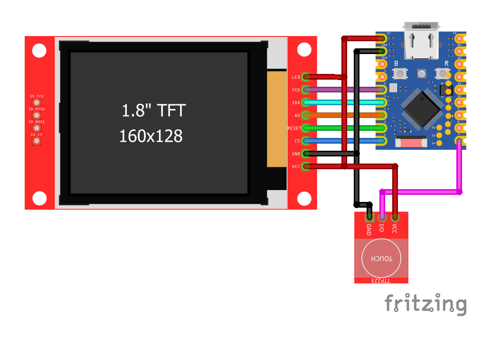

# Retro Game Clock
[](https://ko-fi.com/techtalkies)

A colorful ESP32 desk clock with animated themes inspired by classic retro games.

This project is based on the excellent [SmallOLED-PCMonitor](https://github.com/Keralots/SmallOLED-PCMonitor) project by [Keralots](https://github.com/Keralots). I kept as much of the original clock functionality and configuration system as possible while adapting it for a color TFT display.

## Build Video:

[](https://www.youtube.com/watch?v=9sE63-aa-pQ)

## Features

- Color TFT display
- Animated retro game-inspired clock themes
- Wi-Fi time synchronization
- Touch button to cycle through themes
- Web-based configuration
- Custom 3D-printed enclosure
- ESP32 powered

## Hardware

- ESP32-S3 Zero
- ST7735 160×128 color TFT
- Touch button
- 3D-printed enclosure

## Wiring

### ST7735 TFT

| TFT Pin | ESP32 |
|---|---:|
| MOSI / SDA | GPIO 3 |
| SCK | GPIO 2 |
| CS | GPIO 6 |
| DC / A0 | GPIO 4 |
| RST / RES | GPIO 5 |

### Touch Button

| Component | ESP32 |
|---|---:|
| Touch Button | GPIO 7 |



## Getting Started

## Flash the firmware

You can flash the latest firmware directly from your browser using our online flasher.

1. **Connect your ESP32:** Plug your ESP32 board into your computer using a data-capable USB cable.
2. **Open the online flasher:** Navigate to the [web-based flashing tool](https://techtalkies.github.io/flash.html) in your browser (e.g., Chrome or Edge).
3. **Select firmware:** Choose the **Retro game clock** firmware.
4. **Connect to COM port:** Press the connect button in the web interface and select the serial/COM port that corresponds to your ESP32.
5. **Flash:** Click flash and wait for the process to complete successfully.

### Build it yourself

### 1. Clone this repository
```bash
git clone https://github.com/TechTalkies/Retro-Game-Clock.git
cd Retro-Game-Clock
```

### 2. Open the project

Launch Visual Studio Code and open the Retro-Game-Clock folder. Ensure you have the PlatformIO IDE extension installed.

### 3. Upload

Connect the ESP32. Build and upload the firmware.

## Controls

Use the touch button to cycle through the available clock themes.

The web interface provides additional configuration options for the clock.

> **Note:** Settings labelled **PC** are intended for the PC monitoring functionality and are not required for the standalone clock.

## Support the Project

If you enjoy this project and want to support more builds like this:

[](https://ko-fi.com/techtalkies)

</div>

## Credits

This project is a fork of **SmallOLED-PCMonitor** by **Keralots**.

The original project provided the clock animations, core functionality, configuration system, and much of the foundation used here.

Please check out and support the original project:

**https://github.com/Keralots/SmallOLED-PCMonitor**

## License

See the `LICENSE` file for license information.
